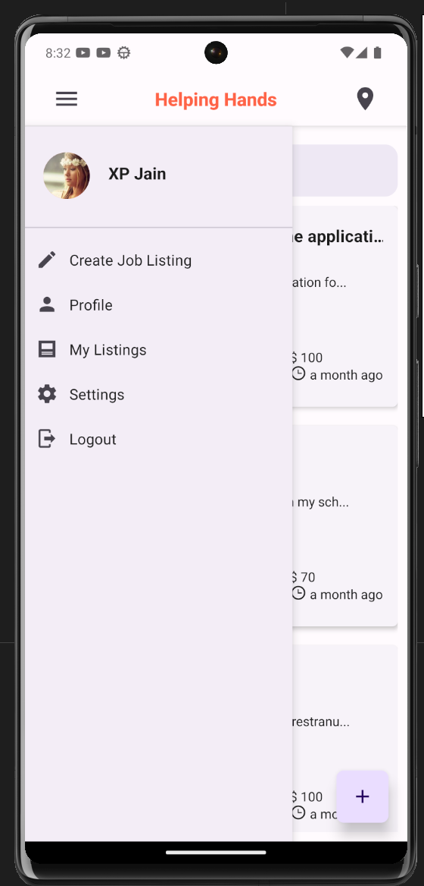
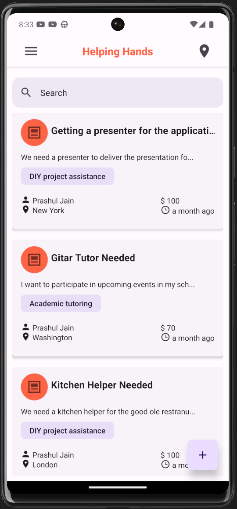
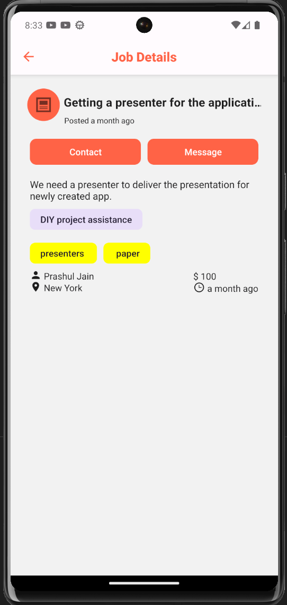
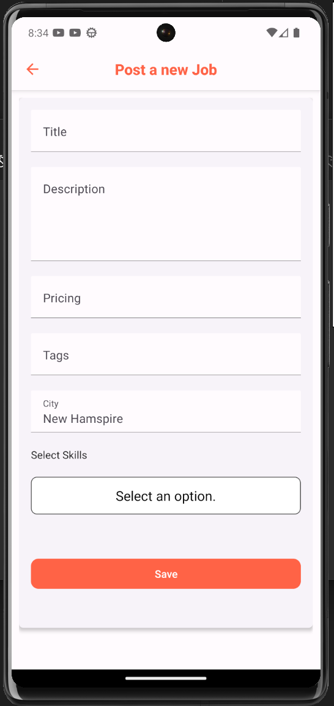

# HELPING HANDS

## Description
Helping Hands is a full stack application that allows users to create an account and post volunteer opportunities. Users can also view volunteer opportunities and sign up to volunteer for them.

[Related Video](https://www.youtube.com/watch?v=nDU6UqHVcOU)

## Deployed Application
You can download the application on your phone using the following links:

[Android](https://github.com/jainprashul/HelpingHand/releases/download/1.0.0/helpingHands_1.0.0.apk)

Or you can grab the latest release from the [releases page](https://github.com/jainprashul/HelpingHand/releases/latest).

## Screenshots
<!-- set size -->






## Table of Contents
* [Installation](#installation)
* [Usage](#usage)
* [Technologies](#technologies)
* [License](#license)
* [Contributing](#contributing)
* [Questions](#questions)

## Installation
To install the necessary dependencies, run the following command:
```
npm install
```

## Environment Variables
To run this application, you will need to add the following to your .env file:
```
EXPO_PUBLIC_SUPABASE_URL= <your supabase url>
EXPO_PUBLIC_SUPABASE_KEY= <your supabase anon key>
```


## Usage
To use this application, run the following command:
```
npm start 
```

## Technologies
* React
* PostgreSQL
* React Native
* Redux

## License
This project is licensed under the MIT license.

## Contributing
If you would like to contribute, please contact me.

## Questions
If you have any questions about the repo, open an issue or contact me directly at <keyboard> </keyboard>. You can find more of my work at [my GitHub](github.com/jainprashul).

    
